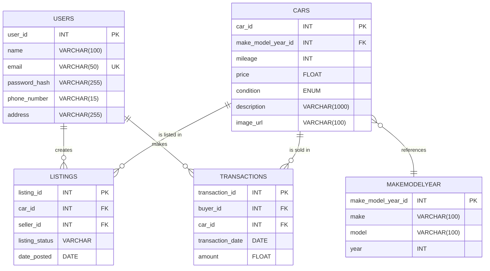

# Coder Academy - Assignment T2A2 - API Webserver Project.

# API Functionality Prioritization and Wish List

## Priority List: Core Functionalities (High Priority).

1. **User Management**

   - **Register** (`POST /api/users/register`): Essential for adding users to the platform.
   - **Login** (`POST /api/users/login`): Necessary for user authentication.
   - **Profile Management** (`GET /api/users/profile`, `PUT /api/users/profile`): Basic user management for viewing and updating user details..

2. **MakeModelYear Management** (Read-Only)

   - **View Makes and Models** (`GET /api/makemodelyear`): Necessary for users to select make, model, and year when adding cars. Simple to implement as it’s a read-only endpoint..

3. **Car Management**

   - **Add Car** (`POST /api/cars`): Essential for adding a car to the database. Simplicity can be maintained by focusing on the basic fields.
   - **View Car** (`GET /api/cars/{car_id}`): Necessary to see the details of a specific car.

4. **Listing Management**

   - **Create Listing** (`POST /api/listings`): Critical for allowing users to list a car for sale. It should reference existing cars.
   - **View Listings** (`GET /api/listings`): Core functionality for browsing available cars. Keep it simple by initially limiting filters to basic ones like price range and make..

5. **Transaction Management**
   - **Create Transaction** (`POST /api/transactions`): Basic endpoint for processing a car purchase and linking a user to a car. Start simple by just recording the buyer, car, date, and amount.

## Wish List: Optional/Advanced Functionalities (Low Priority)

1. **Car Management**

   - **Update Car** (`PUT /api/cars/{car_id}`): Useful but can be postponed since changes can be managed through listings instead.
   - **Delete Car** (`DELETE /api/cars/{car_id}`): More complex as it requires checks to ensure the car isn't part of an existing transaction. Can be deferred.

2. **Listing Management**

   - **Update Listing** (`PUT /api/listings/{listing_id}`): This is slightly more complex as it may involve changing car details or status. Focus on creating and viewing listings first.
   - **Delete Listing** (`DELETE /api/listings/{listing_id}`): More complex due to the need to handle edge cases (e.g., listings tied to a transaction).

3. **Transaction Management**
   - **View Transactions** (`GET /api/transactions`, `GET /api/transactions/{transaction_id}`): Useful for buyers to view their purchase history, but can be deferred as the basic functionality of making transactions is already covered.

## Simplified Path for Initial Implementation

1. **User Management**: Registration, login, and profile viewing/updating.
2. **MakeModelYear**: Basic read-only endpoint for viewing makes and models.
3. **Car Management**: Adding and viewing car details.
4. **Listing Management**: Creating and viewing listings.
5. **Transaction**: Creating a transaction to simulate a purchase.

## Phased Approach to Development

- **Phase 1**: Implement core functionalities that allow users to register, log in, list cars, and make transactions. This establishes the basic marketplace flow.
- **Phase 2**: Add the "wish list" features if time permits, such as updating/deleting cars, listings, and transaction views.

## Final Thoughts

By focusing on the simpler aspects first, we ensure a functional and straightforward car marketplace API. Starting with the most essential and easy-to-implement features allows you to meet basic requirements while keeping room for expansion if time allows.

# Database

