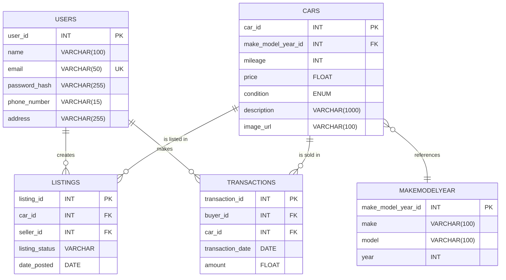

# Coder Academy - Assignment T2A2 - API Webserver Project.

# Table of Contents

- [Overview](#overview)
  - [Purpose of the API](#purpose-of-the-api)
  - [Problem Statement](#problem-statement)
  - [Target Users](#target-users)
  - [Real-World Use Cases](#real-world-use-cases)
- [API Specifications](#api-specifications)
  - [Base URL](#base-url)
  - [Authentication & Authorization](#authentication--authorization)
    - [JWT Authentication Process](#jwt-authentication-process)
    - [Role-Based Access Control](#role-based-access-control)
  - [Supported Formats](#supported-formats)
    - [JSON Request/Response Format](#json-requestresponse-format)
  - [HTTP Methods & Verbs](#http-methods--verbs)
- [Endpoints](#endpoints)
  - [Summary of Endpoints](#summary-of-endpoints)
  - [Detailed Endpoints Reference](#detailed-endpoints-reference)
    - [User Endpoints](#user-endpoints)
    - [Car Endpoints](#car-endpoints)
    - [Listing Endpoints](#listing-endpoints)
    - [Car Transaction Endpoints](#car-transaction-endpoints)
- [Data Model](#data-model)
  - [Entity Relationship Diagram (ERD)](#entity-relationship-diagram-erd)
  - [Data Models (Entities)](#data-models-entities)
    - [User Model](#user-model)
    - [Car Model](#car-model)
    - [Listing Model](#listing-model)
    - [CarTransaction Model](#cartransaction-model)
    - [MakeModelYear Model](#makemodelyear-model)
  - [Table Relationships](#table-relationships)
- [Authentication & Authorization](#authentication--authorization-1)
  - [JWT Token-Based Authentication](#jwt-token-based-authentication)
    - [Token Generation](#token-generation)
    - [Token Validation](#token-validation)
    - [Refreshing Tokens](#refreshing-tokens)
  - [Role-Based Access Control](#role-based-access-control-1)
    - [Admin Permissions](#admin-permissions)
    - [User Permissions](#user-permissions)
- [Error Handling & Status Codes](#error-handling--status-codes)
  - [Standard HTTP Status Codes](#standard-http-status-codes)
  - [Custom Error Messages](#custom-error-messages)
  - [Sample Error Responses](#sample-error-responses)
- [Security](#security)
  - [JWT Token Security](#jwt-token-security)
  - [Best Practices for Securing API Keys](#best-practices-for-securing-api-keys)
- [Testing](#testing)
  - [Using Insomnia/Postman for Manual Testing](#using-insomniapostman-for-manual-testing)
- [Deployment](#deployment)
  - [Local Setup](#local-setup)
  - [Deployment Process](#deployment-process)
- [Project Management](#project-management)
  - [Project Timeline](#project-timeline)
  - [Sprint Planning & Milestones](#sprint-planning--milestones)
    - [Epics and User Stories](#epics-and-user-stories)
    - [Task Breakdown and Assignments](#task-breakdown-and-assignments)
  - [Jira/Project Management Tools Used](#jiraproject-management-tools-used)
    - [Jira Boards and Tracking](#jira-boards-and-tracking)
  - [Risk Management and Mitigation](#risk-management-and-mitigation)

---

# Overview

This README serves as the technical documentation for the **Car Marketplace API**, a RESTful web service built to facilitate transactions for buying, selling, and managing cars in an online marketplace. The API provides endpoints for user management, car listings, transactions, and more.

---

### Purpose of the API

The **Car Marketplace API** serves as the backend infrastructure that developers can leverage to build a comprehensive two-sided car marketplace. This API has strategic endpoints that are well-structured to handle typical car marketplace CRUD interactions such as user authentication, car listing management, secure transactions, and user roles. Developers may use this API to integrate with front-end platforms or mobile applications to create a fully functional car marketplace.

Furthermore, this API is developed as part of a web server development assignment at Coder Academy. It is designed to allow students to showcase their core competencies in API design, authentication, and database management.

---

### Problem Statement

The used car market is predominantly an online affair these days. 80% of car buyers conducting research online before making a purchase decision (Cox Automotive, 2023). Moreover, 67% of buyers prefer an online platform to handle the majority of the purchasing process (Autotrader 2022)

However, as with most platforms of commerce, the online car marketplace also has gaps in efficient and scalable platforms that manage the entire lifecycle of car transactions, from listing a vehicle to completing the sale.

The **Car Marketplace API** addresses this problem by:

- Enabling secure and authenticated transactions between buyers and sellers.
- Allowing sellers to manage their car listings easily.
- Providing buyers with accurate and up-to-date information on available cars.
- Offering administrative control for managing users, cars, and transactions.

**Example Use Case:**

A seller has bought a new vehicle and would like to quickly and securely list their old car for sale. Using a front end built upon this API, the seller could list their car for sale. Using the API’s secure authentication system, they can create an account, upload vehicle details, and monitor offers. Buyers, in turn, can browse listings, negotiate prices, and complete secure transactions, all within a single integrated platform.

**References:**
Cox Automotive, 2023. Car Buyer Journey Report. [online] Available at: https://www.coxautoinc.com/market-insights/car-buyer-journey/ [Accessed 22 Sep. 2024].

Autotrader, 2022. The Digital Future of Automotive Retail. [online] Available at: https://www.autotrader.com/car-news/digital-future-automotive-retail-report [Accessed 22 Sep. 2024].

---

# API Specifications

### Base URL

### Authentication & Authorization

#### JWT Authentication Process

#### Role-Based Access Control

### Supported Formats

#### JSON Request/Response Format

### HTTP Methods & Verbs

# Endpoints

### Summary of Endpoints

### Detailed Endpoints Reference

#### User Endpoints

#### Car Endpoints

#### Listing Endpoints

#### Car Transaction Endpoints

# Data Model

### Entity Relationship Diagram (ERD)

### Data Models (Entities)

#### User Model

#### Car Model

#### Listing Model

#### CarTransaction Model

#### MakeModelYear Model

### Table Relationships

# Authentication & Authorization

### JWT Token-Based Authentication

#### Token Generation

#### Token Validation

#### Refreshing Tokens

### Role-Based Access Control

#### Admin Permissions

#### User Permissions

# Error Handling & Status Codes

### Standard HTTP Status Codes

### Custom Error Messages

### Sample Error Responses

# Security

### JWT Token Security

### Best Practices for Securing API Keys

# Testing

### Using Insomnia/Postman for Manual Testing

# Deployment

### Local Setup

### Deployment Process

# Project Management

### Project Timeline

### Sprint Planning & Milestones

#### Epics and User Stories

#### Task Breakdown and Assignments

### Jira/Project Management Tools Used

#### Jira Boards and Tracking

### Risk Management and Mitigation
