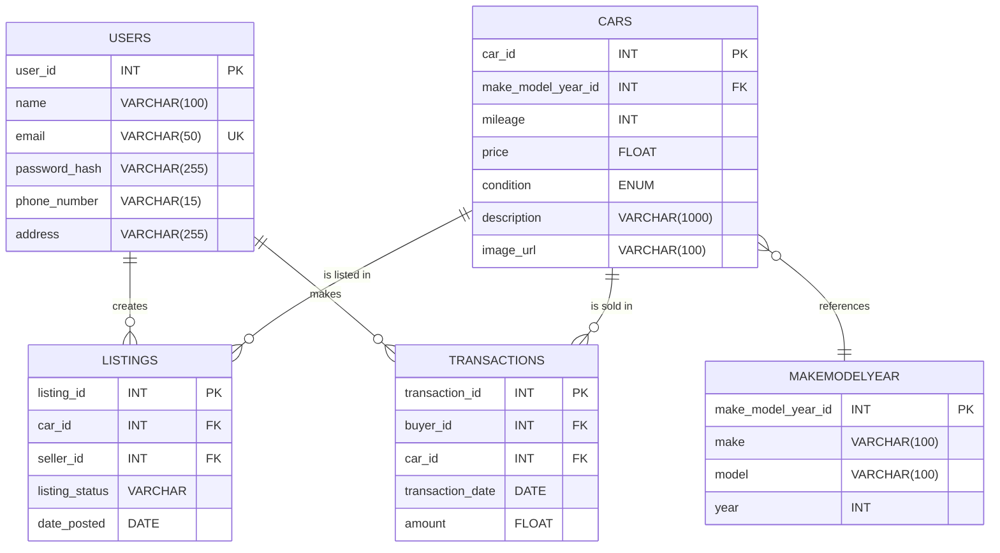

# Coder Academy - Assignment T2A2 - API Webserver Project.

# Table of Contents

- [Overview](#overview)
  - [Purpose of the API](#purpose-of-the-api)
  - [Problem Statement](#problem-statement)
  - [Target Users](#target-users)
  - [Real-World Use Cases](#real-world-use-cases)
- [API Specifications](#api-specifications)
  - [Base URL](#base-url)
  - [Authentication & Authorization](#authentication--authorization)
    - [JWT Authentication Process](#jwt-authentication-process)
    - [Role-Based Access Control](#role-based-access-control)
  - [Supported Formats](#supported-formats)
    - [JSON Request/Response Format](#json-requestresponse-format)
  - [HTTP Methods & Verbs](#http-methods--verbs)
- [Endpoints](#endpoints)
  - [Summary of Endpoints](#summary-of-endpoints)
  - [Detailed Endpoints Reference](#detailed-endpoints-reference)
    - [User Endpoints](#user-endpoints)
    - [Car Endpoints](#car-endpoints)
    - [Listing Endpoints](#listing-endpoints)
    - [Car Transaction Endpoints](#car-transaction-endpoints)
- [Data Model](#data-model)
  - [Entity Relationship Diagram (ERD)](#entity-relationship-diagram-erd)
  - [Data Models (Entities)](#data-models-entities)
    - [User Model](#user-model)
    - [Car Model](#car-model)
    - [Listing Model](#listing-model)
    - [CarTransaction Model](#cartransaction-model)
    - [MakeModelYear Model](#makemodelyear-model)
  - [Table Relationships](#table-relationships)
- [Authentication & Authorization](#authentication--authorization-1)
  - [JWT Token-Based Authentication](#jwt-token-based-authentication)
    - [Token Generation](#token-generation)
    - [Token Validation](#token-validation)
    - [Refreshing Tokens](#refreshing-tokens)
  - [Role-Based Access Control](#role-based-access-control-1)
    - [Admin Permissions](#admin-permissions)
    - [User Permissions](#user-permissions)
- [Error Handling & Status Codes](#error-handling--status-codes)
  - [Standard HTTP Status Codes](#standard-http-status-codes)
  - [Custom Error Messages](#custom-error-messages)
  - [Sample Error Responses](#sample-error-responses)
- [Security](#security)
  - [JWT Token Security](#jwt-token-security)
  - [Best Practices for Securing API Keys](#best-practices-for-securing-api-keys)
- [Testing](#testing)
  - [Using Insomnia/Postman for Manual Testing](#using-insomniapostman-for-manual-testing)
- [Deployment](#deployment)
  - [Local Setup](#local-setup)
  - [Deployment Process](#deployment-process)
- [Project Management](#project-management)
  - [Project Timeline](#project-timeline)
  - [Sprint Planning & Milestones](#sprint-planning--milestones)
    - [Epics and User Stories](#epics-and-user-stories)
    - [Task Breakdown and Assignments](#task-breakdown-and-assignments)
  - [Jira/Project Management Tools Used](#jiraproject-management-tools-used)
    - [Jira Boards and Tracking](#jira-boards-and-tracking)
  - [Risk Management and Mitigation](#risk-management-and-mitigation)

---

# Overview

### Purpose of the API

### Problem Statement

### Target Users

### Real-World Use Cases

# API Specifications

### Base URL

### Authentication & Authorization

#### JWT Authentication Process

#### Role-Based Access Control

### Supported Formats

#### JSON Request/Response Format

### HTTP Methods & Verbs

# Endpoints

### Summary of Endpoints

### Detailed Endpoints Reference

#### User Endpoints

#### Car Endpoints

#### Listing Endpoints

#### Car Transaction Endpoints

# Data Model

### Entity Relationship Diagram (ERD)

### Data Models (Entities)

#### User Model

#### Car Model

#### Listing Model

#### CarTransaction Model

#### MakeModelYear Model

### Table Relationships

# Authentication & Authorization

### JWT Token-Based Authentication

#### Token Generation

#### Token Validation

#### Refreshing Tokens

### Role-Based Access Control

#### Admin Permissions

#### User Permissions

# Error Handling & Status Codes

### Standard HTTP Status Codes

### Custom Error Messages

### Sample Error Responses

# Security

### JWT Token Security

### Best Practices for Securing API Keys

# Testing

### Using Insomnia/Postman for Manual Testing

# Deployment

### Local Setup

### Deployment Process

# Project Management

### Project Timeline

### Sprint Planning & Milestones

#### Epics and User Stories

#### Task Breakdown and Assignments

### Jira/Project Management Tools Used

#### Jira Boards and Tracking

### Risk Management and Mitigation
