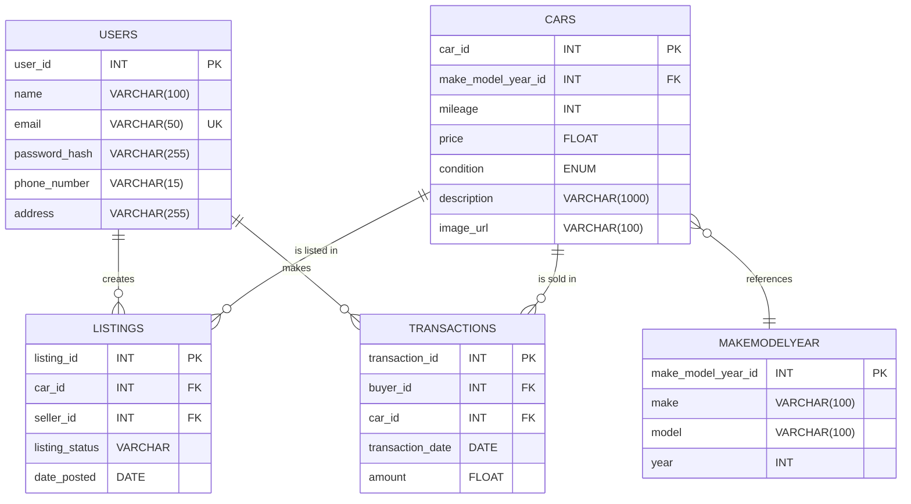

Hi Iryna,

## Updates

I have had another look at the tables and I i can't believe I missed something so obvious.

Make,model and year might have multiple listings of the same type car, Storing directly in the Cars table could lead to repeated entries. I should make a new table for this. The new table will be called MakeModelYear.

MakeModelYear Table
Description: Each unique combination of make, model, and year can be referenced by multiple cars.

Fields:
make_model_year_id: INT, Primary Key, Serialized
make: VARCHAR(100), Not Null
model: VARCHAR(100), Not Null
year: INT, Not Null

Relationship: One-to-Many from MakeModelYear to Cars. Mandatory as every car must be associated with a specific make-model-year combination.

Updated ERD shown.

## Normalization Check

1. USERS Table

1NF:

- Atomic and each column has a single value per row.
- Pass ✅

2NF:

- 1NF.
- The primary key is a single field (user_id), No partial dependencies.
- Pass ✅

3NF:

- No transitive dependencies can be seen.
  Pass ✅

2. CARS Table

1NF:

- All fields contain atomic values.
- Pass ✅

2NF:

- The table is already in 1NF.
- The primary key is a single field (car_id), Noo partial dependencies.
- Pass ✅

3NF:

- No transitive dependencies can be seen.
  Pass ✅

3. MAKEMODELYEAR Table

1NF:

- All fields contain atomic values.
- Pass ✅

2NF:

- The table is already in 1NF.
- The primary key is a single field (make_model_year_id),, No partial dependencies.
- Pass ✅

3NF:

- No transitive dependencies can be seen. each non-key attribute is directly dependent on the primary key (make_model_year_id).
- Pass ✅

4. LISTINGS Table

1NF:

- All fields contain atomic values.
- Pass ✅

2NF:

- The table is already in 1NF.
- The primary key is a single field (listing_id), No partial dependencies.
- Pass ✅

3NF:

- No transitive dependencies can be seen.
- Pass ✅

5. TRANSACTIONS Table

1NF:

- All fields contain atomic values.
- Pass ✅

2NF:

- The table is already in 1NF.
- The primary key is a single field (transaction_id), Noo partial dependencies.
- Pass ✅

3NF:

- No transitive dependencies can be seen.
- Pass ✅
